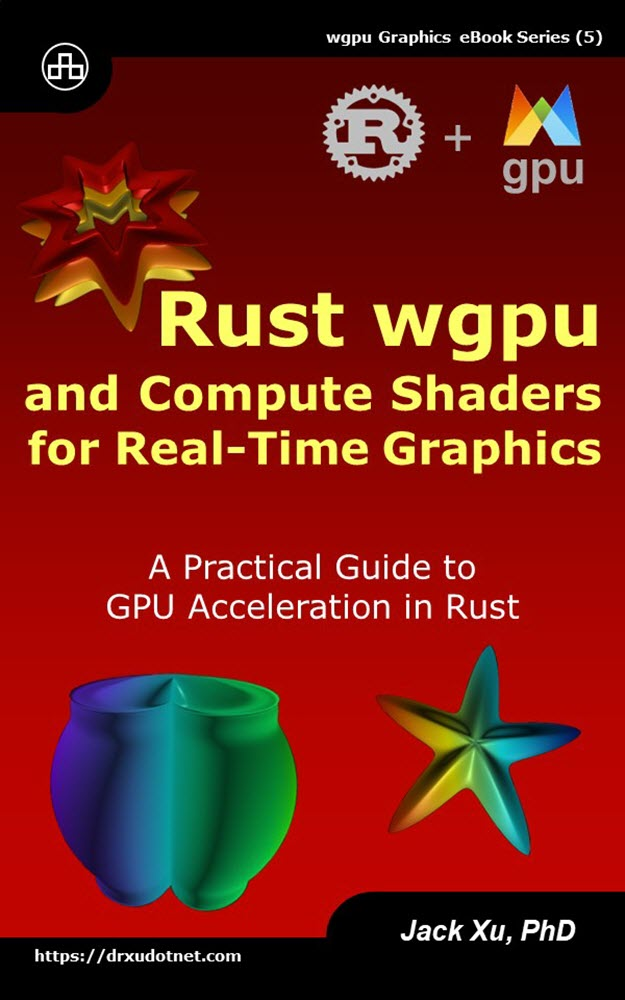

# Rust wgpu and Compute Shaders for Real-Time Graphics  
## A Practical Guide to GPU Acceleration in Rust

This is the source code of example projects contained in the eBook ["Rust wgpu and Compute Shaders for Real-Time Graphics"](https://www.amazon.com/exec/obidos/ASIN/B0CLSV3SPT/unicadinccom-20). 

